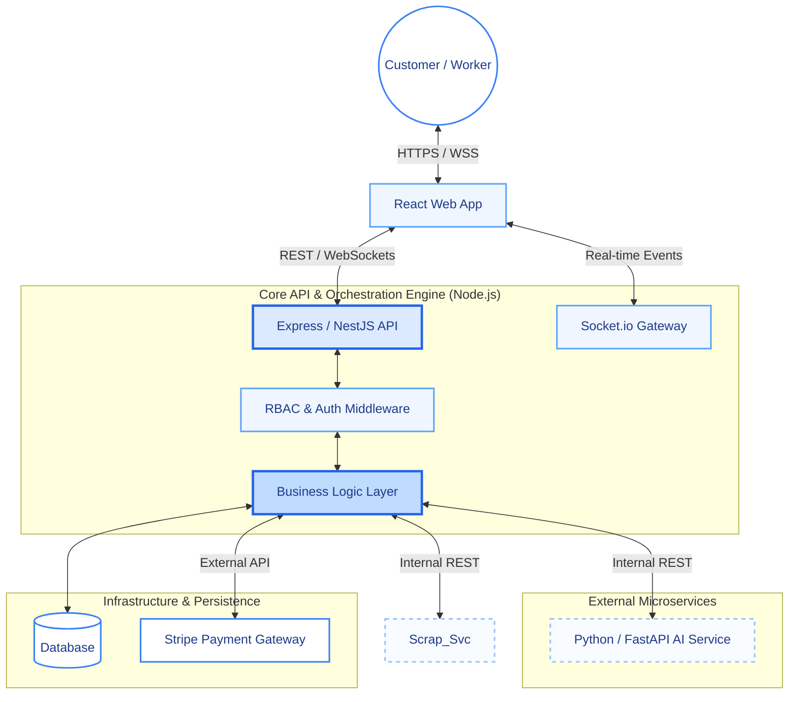

# JobDone Frontend: Customer & Professional Portal


The JobDone Frontend is the primary customer and worker-facing web application for the JobDone marketplace platform. It provides a modern, responsive, and real-time experience for service booking, worker discovery, messaging, payments, and job management.

---

## Table of Contents

* [Overview](#overview)
* [Key Features](#key-features)
* [Design Language](#design-language)
* [Tech Stack](#tech-stack)
* [Architecture Diagram](#architecture-diagram)
* [Installation](#installation)
* [Environment Variables](#environment-variables)
* [Running the Application](#running-the-application)
* [Project Structure](#project-structure)
* [Core Features](#core-features)
* [Backend Integration](#backend-integration)

---

## Overview

This repository contains the high-fidelity frontend for the JobDone service marketplace platform.

The application supports two primary user roles:

* Customers looking for trusted workers
* Skilled workers offering services

The interface is built using React and Tailwind CSS, with a premium visual style inspired by a “Paper & Ink” design language. The frontend integrates tightly with the JobDone backend, AI microservice, Google Maps, Stripe, and Socket.io for a fully interactive experience.

---

## Key Features

### Dual-Role Experience

* Separate dashboard experiences for customers and workers
* Customers can:

  * Search for workers
  * Book services
  * Track ongoing jobs
  * Review completed work
* Workers can:

  * Manage availability
  * Track earnings
  * Respond to work requests
  * Manage completed tasks

### Real-Time Communication

* Socket.io-powered live chat between customers and workers
* Real-time job updates and notifications
* online presence support

### Smart Worker Discovery

* Integrated Google Maps support
* Find nearby workers based on service type and location

### AI-Powered User Experience

* Uses the Python/FastAPI microservice to:

  * Predict estimated cost
  * Understand customer problem descriptions
  * Recommend likely service categories

### Secure Payments

* Stripe Elements integration
* Secure card collection and checkout process
* Payment flow for job confirmation and completion

---

## Design Language

The application follows a consistent premium design system.

### Visual Style

* White and deep navy base palette
* Blue accent colors for actions and highlights
* Glassmorphism-inspired cards with subtle blur effects
* Squircle-based geometry instead of standard rounded corners

### UI Principles

* Smooth transitions and micro-interactions
* Clean typography and spacious layouts
* Minimal but expressive visual hierarchy
* Consistent reusable component design

---

## Tech Stack

| Category          | Technology                          |
| ----------------- | ----------------------------------- |
| Framework         | React.js                            |
| Styling           | Tailwind CSS + Custom Design System |
| Routing           | React Router                        |
| API Communication | Axios                               |
| Real-Time         | Socket.io Client                    |
| Maps              | Google Maps Platform                |
| Payments          | Stripe Elements                     |
| Forms             | React Hook Form                     |
| Build Tool        | Vite                                |

---

## Architecture Diagram



---

## Installation

### 1. Clone the Repository

```bash
git clone https://github.com/NipunaRandiya/job-done-app.git
cd job-done-app
```

### 2. Install Dependencies

```bash
npm install
```

### 3. Configure Environment Variables

Create a `.env` file in the project root:

```env
VITE_API_BASE_URL=http://localhost:5000/api
VITE_GOOGLE_MAPS_API_KEY=your_google_maps_key
VITE_STRIPE_PUBLISHABLE_KEY=your_stripe_publishable_key
```

---

## Environment Variables

| Variable                      | Description                          |
| ----------------------------- | ------------------------------------ |
| `VITE_API_URL`                | Base URL for the Node.js backend API |
| `VITE_GOOGLE_MAPS_API_KEY`    | Google Maps API key                  |
| `VITE_STRIPE_PUBLISHABLE_KEY` | Stripe public key                    |

---

## Running the Application

### Development Mode

```bash
npm run dev
```

### Production Build

```bash
npm run build
```

---

## Project Structure

```text
src/
├── assets/             # Images, icons, logos, and brand assets
├── components/         # Shared UI components
│   ├── admin/
│   ├── customer/
│   ├── shared/
│   └── worker/'
├── context/  
├── layout/             # Layout wrappers
├── pages/              # Route-level pages
│   ├── admin/
│   ├── auth/
│   ├── customer/
│   ├── worker/
│   └── landing/
├── services/           # Axios and Socket.io setup
├── utils/              # Helper functions
└── main.jsx            # Application entry point
```

---

## Core Features

### Customer Features

* Account registration and login
* Search nearby workers
* Create work requests
* Chat with workers
* Pay securely through Stripe
* Leave ratings and reviews

### Worker Features

* Register and manage profile
* Update availability status
* Accept or reject jobs
* Track earnings and task history
* Communicate with customers in real time

### Admin Features

* Review and approve workers
* Monitor platform activity
* Manage pending approvals and reports

---

## Backend Integration

The frontend is designed to work with the JobDone Core API and related microservices.

Expected backend services:

| Service            | Purpose                                  |
| ------------------ | ---------------------------------------- |
| Node.js Core API   | Authentication, jobs, workers, messaging |
| FastAPI AI Service | Cost estimation and text analysis        |

The frontend requires CORS and WebSocket support to be enabled on the backend.

